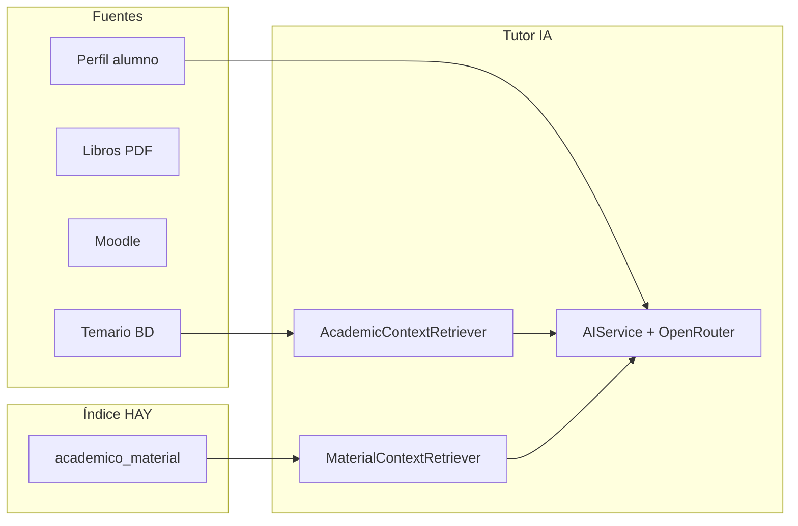

# Materiales institucionales y RAG del Tutor IA

Este documento explica **cómo alimentar al Tutor IA** con libros CNCM, planeación del profesor, workbook del alumno y actividades Moodle, además del temario ya existente en `fase_temario_semana`.

## Arquitectura en tres capas



| Capa | Qué contiene | Estado |
|------|----------------|--------|
| **Temario** | `fase_temario_semana`, fases, especialidades | Ya integrado |
| **Perfil alumno** | Gustos en `alumnos.perfil_*` | Onboarding al primer acceso |
| **Materiales** | Libros versionados, Moodle en `academico_material` | Panel **Libros y materiales** + sync Moodle |
| **Embeddings** | `academico_material_embedding` | OpenRouter `text-embedding-3-small` |

## Libros versionados (recomendado)

| Tabla | Uso |
|-------|-----|
| `academico_libro` | Catálogo por especialidad + tipo (studentbook, workbook, …) |
| `academico_libro_version` | Varias ediciones PDF (`2025.1`, `2026.1`); flags `activo_alumno` y `activo_rag` |
| `academico_material` | Una fila por página indexada (`id_version`) |
| `academico_material_embedding` | Vector por chunk para búsqueda semántica |

**Panel:** Académico → **Libros y materiales** (`academico_libros`)

1. Crear libro por especialidad (o `php scripts/seed_libros_catalogo.php`)
2. Subir PDF con etiqueta de versión
3. Marcar versión activa para **alumnos** y/o **Tutor IA**
4. Pulsar **Indexar** (o CLI: `php scripts/libro_indexar_version.php ID_VERSION`)

**Alumno:** Menú → **Mis libros** — lector en línea sin descarga directa (stream con token).

## Sincronización Moodle automática

Requiere `moodle_course_id` en `especialidad_fases`.

```bash
php scripts/sync_moodle_material.php
php scripts/sync_moodle_material.php 3   # solo especialidad id=3
```

O desde el panel **Sincronizar Moodle**. Indexa actividades visibles (`quiz`, `page`, `assign`, etc.) en `academico_material`.

## Tabla `academico_material`

Cada fila es un fragmento recuperable por el tutor:

| Campo | Uso |
|-------|-----|
| `tipo` | `libro_alumno`, `libro_profesor`, `workbook`, `studentbook`, `guia_profesor`, `moodle_actividad`, `pdf_fragmento` |
| `id_especialidad`, `id_fase`, `semana` | Filtrar por programa del alumno |
| `pagina_inicio`, `pagina_fin` | Preguntas tipo “página 45” |
| `titulo`, `descripcion` | Metadatos para sugerir al alumno |
| `contenido_texto` | Texto extraído del PDF (lo que “lee” la IA) |
| `moodle_url`, `moodle_course_id`, `moodle_cm_id` | Enlace a actividad Moodle |
| `ruta_archivo` | Ruta al PDF original en el servidor |

### Ejemplo SQL (una página de workbook)

```sql
INSERT INTO academico_material
  (tipo, id_especialidad, semana, pagina_inicio, pagina_fin, titulo, descripcion, contenido_texto, activo)
VALUES
  ('workbook', 3, 2, 45, 45,
   'Workbook ING — Semana 2, p.45',
   'Ejercicio de Present Simple',
   'Complete the sentences with the correct form of the verb... Answer key: 1) goes 2) play 3) does...',
   1);
```

## Cómo pasar de InDesign/PDF a la base de datos

### Opción A — Recomendada para empezar (por lección/semana)

1. Exporte el PDF desde InDesign (libro alumno, workbook, guía profesor).
2. Extraiga texto por **bloques lógicos** (una lección, una página o un ejercicio), no todo el libro en una sola fila.
3. Use el script CSV:

```bash
php scripts/importar_material_csv.php ruta/material_ing_semana2.csv
```

Formato CSV (cabeceras):

```csv
tipo,id_especialidad,semana,pagina_inicio,pagina_fin,titulo,descripcion,contenido_texto,moodle_url
workbook,3,2,45,45,Present Simple p.45,Ejercicio workbook,"Texto del ejercicio...", 
moodle_actividad,3,2,,,Quiz semana 2,Repaso listening,,https://moodle.cncm.edu.mx/mod/quiz/view.php?id=123
```

### Opción B — Extracción masiva de PDF

En el servidor (Linux) con `pdftotext`:

```bash
pdftotext -layout libro_alumno.pdf libro_alumno.txt
```

Luego parta el `.txt` por marcadores (`--- Página 45 ---`) y cargue cada trozo con el CSV o SQL.

**InDesign:** no hace falta subir `.indd` al servidor; el PDF exportado es la fuente de verdad para indexar.

### Opción C — Fase 2 (embeddings)

Cuando tengan muchos libros, se puede añadir:

- tabla `academico_material_embeddings` (vector por chunk)
- búsqueda semántica en lugar de `LIKE`

La tabla actual ya guarda `contenido_texto` listo para ese paso.

## Moodle

1. **Manual:** por cada actividad relevante, inserte fila `tipo=moodle_actividad` con `moodle_url` y `semana`.
2. **Automático (futuro):** script que use `core_course_get_contents` vía `moodle_api_call` y rellene `academico_material` vinculando `id_fase` del curso HAY.

El tutor ya puede decir: *“Repasa el quiz de la semana 2 en Moodle”* si esa URL está indexada.

## Libro del profesor (planeación sugerida)

Indexe cada lección como `guia_profesor` o `libro_profesor` con:

- `semana` alineada al temario CNCM
- `contenido_texto` = objetivos, actividades sugeridas, tiempos

Así el tutor puede alinear su respuesta con la planeación oficial del libro, no solo con `fase_temario_semana`.

## Perfil de gustos del alumno

Al primer acceso (después de cambiar contraseña), el alumno completa `alumno_perfil_gustos`. Los datos van a:

- `alumnos.perfil_gustos` (resumen para la IA)
- `alumnos.perfil_intereses_json` (campos estructurados)

El bloque `[PERFIL PERSONAL DEL ALUMNO]` se inyecta en cada mensaje del tutor para personalizar ejemplos.

**Planeación del profesor:** al elegir grupo en **Planeaciones**, se muestran los gustos del grupo. La IA (`gemini_sugerir_planeacion.php`) recibe `planeacion_grupo_gustos_texto()`.

## Diagnóstico

```bash
php scripts/tutor_diagnostico_temario.php
```

Muestra semanas de temario por especialidad y cuántos materiales hay indexados.

## Buenas prácticas

1. **Un chunk = un propósito** (una página, un ejercicio, una actividad Moodle).
2. **Siempre vincule** `id_especialidad` y `semana` cuando sea posible.
3. **No suba soluciones completas de exámenes**; el tutor está configurado para guiar, no entregar examen resuelto.
4. **Actualice** cuando cambie edición del libro (nueva exportación PDF → reimportar CSV).
5. Revise en el chat del tutor con `contexto_preview` en la respuesta API si el material correcto aparece.

## Archivos relacionados

- `php/tutor/MaterialContextRetriever.php` — búsqueda en `academico_material`
- `php/tutor/AcademicContextRetriever.php` — temario CNCM
- `php/alumno_perfil_helper.php` — perfil de gustos
- `scripts/importar_material_csv.php` — importación masiva
- `scripts/tutor_diagnostico_temario.php` — diagnóstico
