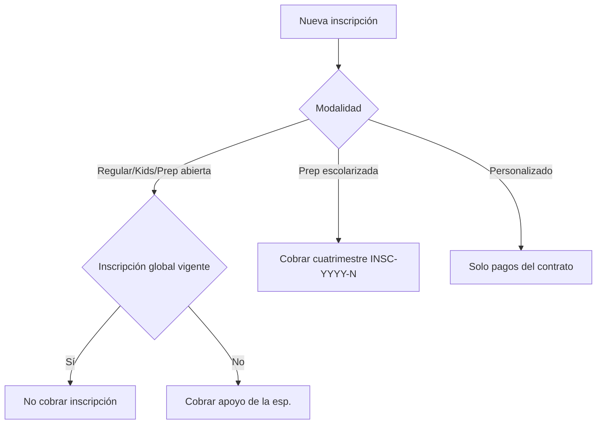

# CNCM — Modelo operativo de la escuela

Documento maestro del sistema HAY: catálogo, inscripción, cobranza, comisiones, roles y menús.
Complementa `ROLES_Y_PERMISOS.md`, `INGLES_PILOTO_ESPECIFICACION.md` y `FASE2_ACADEMICO.md`.

## 1. Organigrama y roles

| Puesto CNCM | Rol sistema | Alcance |
|-------------|-------------|---------|
| Supervisor | `supervisor` | Todos los planteles; edita costos catálogo |
| Director de plantel | `director` | Operación completa del plantel |
| Gerente de ventas | `gerente` | Captación, comisiones, cartas |
| Coordinador académico | `coordinador` | Maestros, calificaciones, planeaciones |
| Recepción | `admin` | Caja, alumnos, pre-registro |
| Asesor | `asesor` | Pre-registro, entrevistas, captación |
| Profesor | `profesor` | Aula, portal docente |
| Alumno | `alumno` | Portal alumno |

**Migración:** usuarios con rol histórico `gerente` (director de plantel) → `director`. El rol `gerente` queda para ventas.

## 2. Catálogo académico

### Tipos de especialidad

| Tipo | Modalidad | Inscripción |
|------|-----------|-------------|
| Regular (ING, COMP, ROB) | `regular` | Global $700 apoyo |
| Kids | `kids` | Global $700 |
| Prep abierta | `prep_abierta` | Global $700 |
| Prep escolarizada | `prep_escolarizada` | $650/cuatrimestre |
| Extensivo | `extensivo` | Global $700 |
| Temporal | `es_fija=0` + fechas venta | Según base |
| Personalizado | contrato | Sin inscripción global |

### Precio referencia + apoyo educativo

Cada especialidad define **par propio** de montos:

- `costo_*_referencia` — precio de lista (ventas)
- `costo_*_apoyo` — cobro habitual (congelado al inscribir)

Al inscribir: snapshot en `alumno_especialidades` (referencia + apoyo). Cambios de catálogo **no** afectan inscritos.

**Solo supervisor** edita costos (`catalogo_editar_costos`).

### Tarifas cartas

Tabla `especialidad_tarifa_cartas`: inscripción mínima $450 (gerente define campaña). Reparto: $100 repartidores + $150 cierre + extra sobre mínimo.

### Planes de estudio versionados

- `plan_estudio_version` — versiones por especialidad
- `alumno_plan_asignado` — versión al inscribir
- `especialidad_fases.id_plan_version` — fases por versión

## 3. Protocolo de inscripción académica (Bloque F)

| Validación | Autorizador |
|------------|-------------|
| Edad fuera de rango | Coordinador, director o supervisor |
| Fase avanzada / ubicación | Coordinador, director o supervisor |

Edades default: ING/COMP ≥13; Kids 8–12; Prep abierta ≥18; Prep esc. 14–19.

Tabla `inscripcion_autorizacion`: solicitud → aprobación.

## 4. Inscripción y cobranza

### Apoyo educativo en POS

- Modo default: cobrar `*_apoyo`
- Toggle «precio de lista»: cobrar `*_referencia`
- Ticket: referencia − apoyo = total + colegiatura congelada

### Cuentas A / B

| Medio | Cuenta |
|-------|--------|
| Tarjeta débito / crédito | A |
| Transferencia | A |
| Efectivo + requiere factura | A |
| Efectivo sin factura | B |
| Productos | B (solo efectivo) |

## 5. Comisiones ventas

| Escenario | Comisión asesor |
|-----------|-----------------|
| Inscripción $700 | $250 (tabulador) |
| Descuento asesor mín. $500 | $250 − $100 = $150 |
| Director autoriza excepción | Manual + opcional tabulador |
| Cartas | $100 repartidor + $150 cierre |

Tablas: `ventas_movimiento`, `ventas_tabulador`, `inscripcion_cartas_*`.

## 6. Cursos personalizados

- `curso_personalizado` + `curso_personalizado_pago`
- Sin `pago_crear_inscripcion()` al crear contrato
- Si después entra a especialidad regular → sí inscripción global

## 7. Menús por flujo

Definidos en `php/menu_config.php`:

1. Ventas y captación
2. Caja y cobranza
3. Alumnos
4. Académico
5. Administración
6. Mi desarrollo HAY / Sistema HAY

## 8. Checklist brechas vs código

| Ítem | Estado |
|------|--------|
| Roles director/gerente/coordinador | Implementado (`operativo_cncm_helper`) |
| Catálogo dual referencia/apoyo | Implementado |
| Plan versionado | Implementado (`plan_version_helper`) |
| Protocolo inscripción | Implementado (`inscripcion_protocolo_helper`) |
| Cursos personalizados | Implementado (`curso_personalizado_helper`) |
| POS apoyo educativo | Implementado (punto_venta + pago_pos_api) |
| Cuentas A/B | Existente (`pago_resolver_cuenta_contable`) |
| Reporte ventas + corte | Existente (`reporte_ventas`, `reporte_financiero_helper`) |
| Comisiones cartas/director | Implementado (`ventas_comision_helper`) |
| Menú por flujos | Implementado (`menu_config.php`) |
| Módulo asesorías académicas | Implementado (`044_asesoria_schema`, `asesoria_*`) |

## 9. Asesorías académicas

Módulo operativo en recepción/coordinación (`views/asesoria_*.php`, `php/asesoria_*`).

### Tipos

| Clave | Uso |
|-------|-----|
| `falta_gratis` | Falta a clase propia; gratis si Moodle OK (excepto computación) |
| `pagada_cross` | Materia no inscrita (~$200/alumno) |
| `pagada_materia` | Materia inscrita con cobro |
| `regularizacion` | Crédito inscripción tardía (solo individual) |
| `kids` / `kids_dual` | Kids 1h o dual |

### Estados de cita

`agendada` → `confirmada` → `impartida` | `np` | `cancelada_a_tiempo` | `reagendada`

- **NP**: cobro reagendar al alumno + pago reducido al profesor (tabulador).
- **Cancelada ≥2 h antes**: sin cobro ni pago profesor.

### Tabulador

Editable en **Tabulador asesorías** (`asesoria_tabulador_admin`). Claves: `alumno_materia_externa`, `alumno_reagendar_np`, `prof_1_alumno`, `prof_2plus_mismo_tema`, `prof_np_sin_clase`.

### Flujo recepción

1. **Agendar asesoría** — buscar alumno inscrito, tipo, materia/tema, profesor con slot en `asesoria_disp`.
2. **Agenda del día** — confirmar, marcar impartida/NP/cancelada.
3. **Calendario** — vista semanal por plantel.

Reglas: mínimo 1 día de anticipación (override con cap `asesoria_autorizar_mismo_dia`); personalizado sin asesoría por falta; grupal mismo tema hasta 3 alumnos.

### Inscripción tardía (Avanzado)

Wizard inscripción: grupo en curso ≤21 días → semana extra opcional + 0–3 créditos `asesoria_credito` (`origen=inscripcion_tardia`).

### Nómina

Pagos en `asesoria_pago_profesor` se importan a `nomina_linea` al generar nómina (`asesoria_nomina_importar`).

## 10. Referencia técnica

- Esquema: `operativo_cncm_ensure_schema()` en `php/operativo_cncm_helper.php`
- Guards vistas: `php/rbac_view_guard.php` → `rbac_require_cap()`
- Bootstrap: paso `operativo` en `config.php` (`HAY_SCHEMA_VERSION` ≥ 4)
